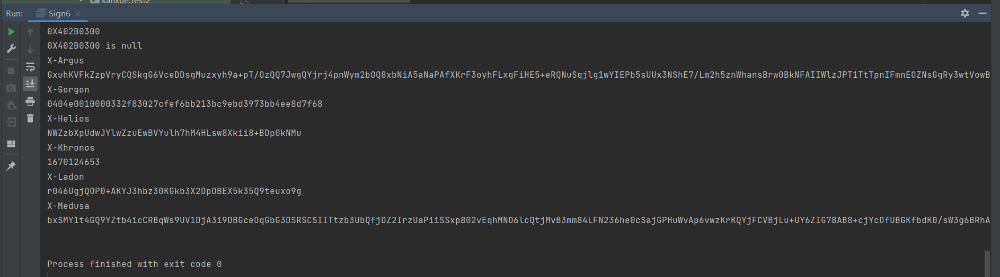

# dy233_unidbg_sign
use unidbg to emulate dy 23.3.0 for X-Medusa and X-Helios

## how to run
1. git clone https://github.com/zhkl0228/unidbg (the version is [3512f1d33c417c2f835430916b58612b0f7d599c](https://github.com/zhkl0228/unidbg/commit/3512f1d33c417c2f835430916b58612b0f7d599c))
2. download dy233.apk from [wandoujia](https://www.wandoujia.com/apps/7461948/history_v230301?spm=aligames_platform_ug.wdj_seo.0.0.6df17386bjmcsb)
3. place "dy233.apk" in the relative directory "unidbg-android/src/test/resources/dy233"
4. place "Sign6.java" in the relative directory "unidbg-android/src/test/java/com/ss/android/ugc/aweme"
5. remove the code ```vm.checkVersion(version)``` from the relative path "unidbg-android/src/main/java/com/github/unidbg/linux/android/dvm/DalvikModule.java"
6. place "exe" in the relative directory "unidbg-android/src/main/resources/android/sdk23/proc/self"
6. execute the main function of Sign6.java

## example


## bug
There is a bug in the signature obtained by running the code. The X-Argus field should have a length of 240, but it is only 216. At present, I'm still trying to locate and solve the bugs.
